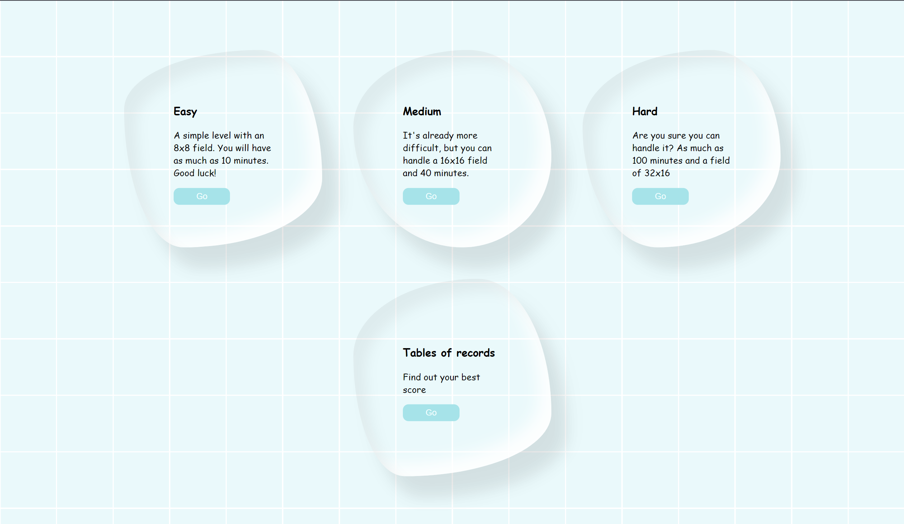
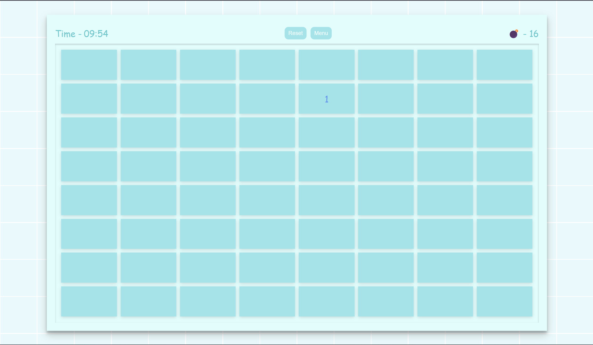
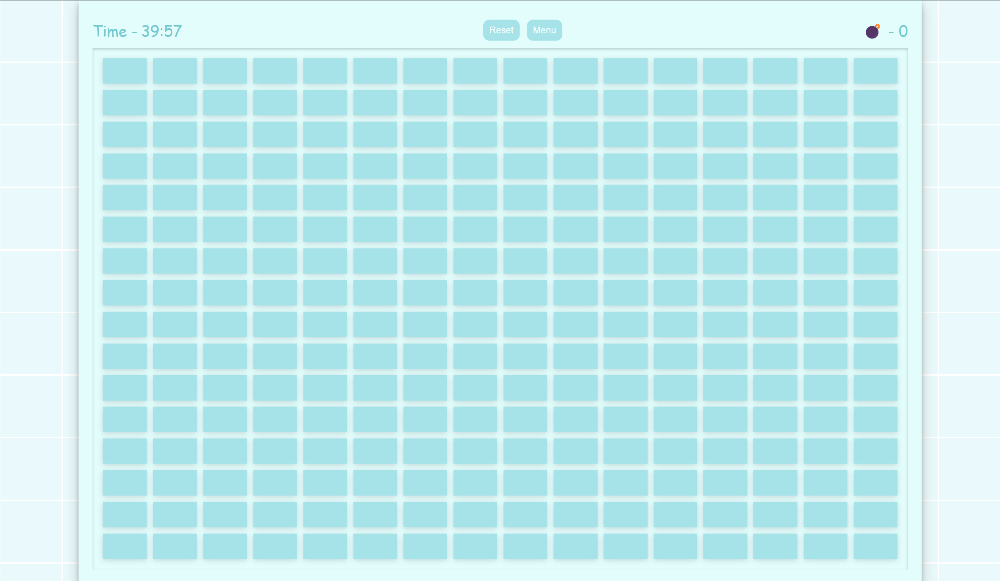
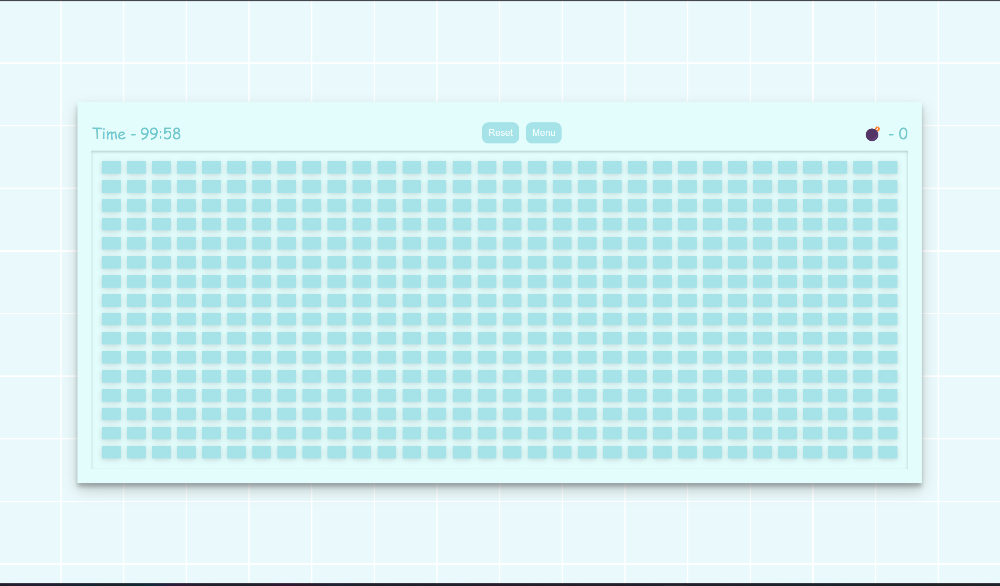
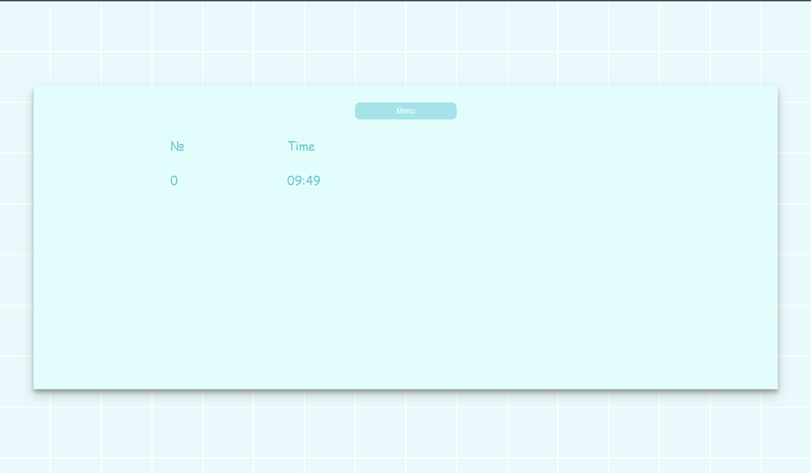

# Sapper

Minesweeper is a logic puzzle video game genre. The game features a grid of clickable squares, with hidden "mines"
scattered throughout the board.

## The objective

The objective is to clear the board without detonating any mines, with help from clues about the number of neighboring
mines in each field.

## Description

There are **three** variants of the game:

* simple (8x8)
* medium (16x16)
* complex (32x16)

They differ in the **size** of the fields and the **time** allotted for the game. If you win, you can see the
statistics. On the right mouse button, it is possible to put checkboxes or questions.

## Prerequisites

To set up the game:

1. Clone [repository](https://github.com/dowlsss/sapper);
2. Install and set up [Node.js](https://nodejs.org/en/download/);
3. Install and set up [npm package manager](https://docs.npmjs.com/downloading-and-installing-node-js-and-npm);

**For `dev` server:**

4. In project folder run `npm start`;
5. Go to [localhost:3000](http://localhost:3000).

**For production build:**

4. Run `npm build` for production version;
5. Checkout `build` folder.

## Screenshots

